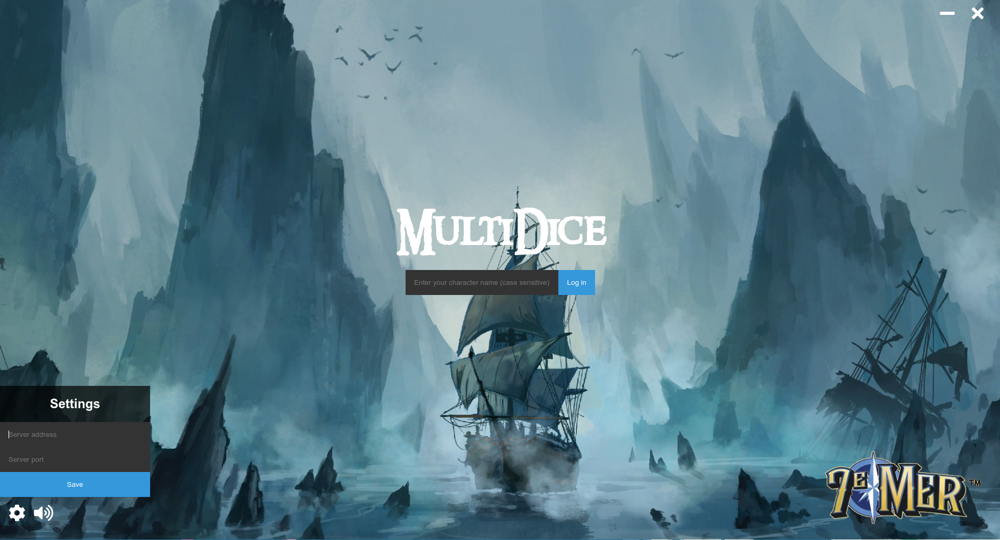
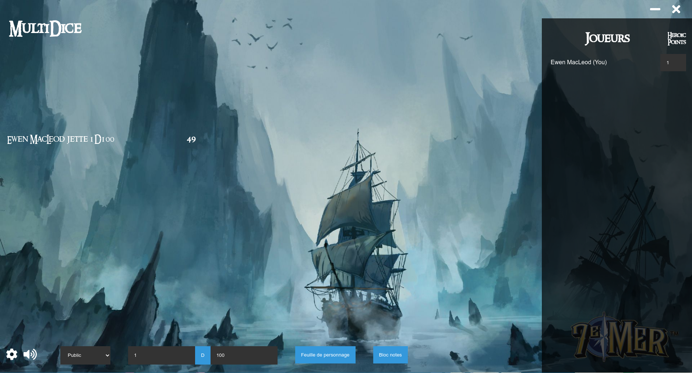
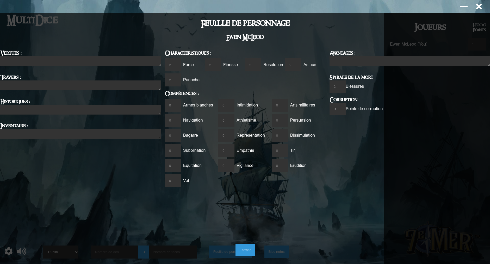
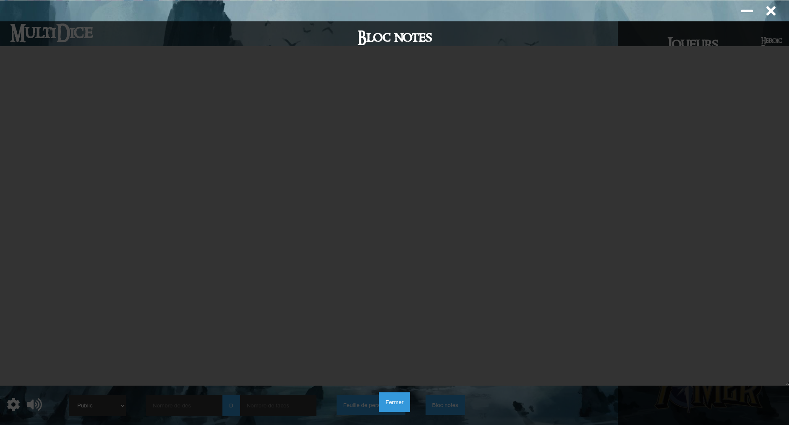

# Multidice

**Jouez au jeu de rôle 7e Mer avec vos amis à distance grâce à Multidice**

#### **Pour utiliser ce logiciel il faut également installer "Multidice-Server" sur un serveur accessible depuis le web**

## Overview

   

## Fonctionnalités

### Lancé de dés

Multidice permet de faire des lancés de dés en choisissant le nombre de dés ainsi que le nombre de faces de ces derniers Ces lancés peuvent être public, privés ou visible uniquement par le lanceur et le MJ.

Les 6 derniers lancés de dés apparaissent à l'écran.

### Gestion de la fiche de personnage

Multidice permet de remplir et modifier sa fiche de personnage afin d'y accèder directement depuis l'application. Il est également possible de visualiser la fiche de personnage des autres joueurs du salon, sans pouvoir la modifier.

### Bloc-note

Multidice donne également la possibilité de stocker des informations relative au jeu sous forme d'un bloc-note accessible et modifiable depuis l'application.

## Build

Pour build Multidice il faut [Electron Builder](https://www.electron.build/).

Pour l'installer, executer depuis le dossier racine :

```
yarn add electron-builder --dev
```

### Windows

```
yarn build -w
```

### Linux

La configuration de build par défaut créé une AppImage et un fichier pacman.

```
yarn build -l
```

## License

[MIT](LICENSE.md)
